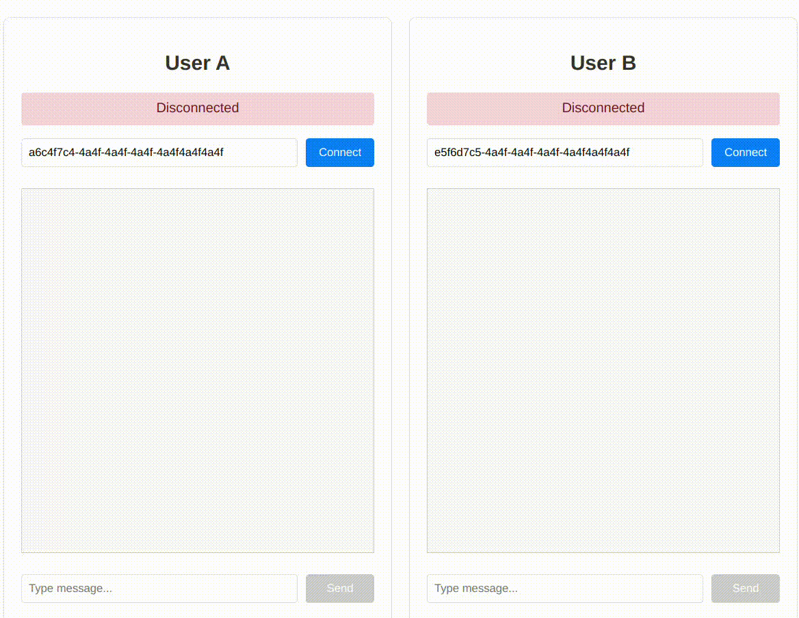
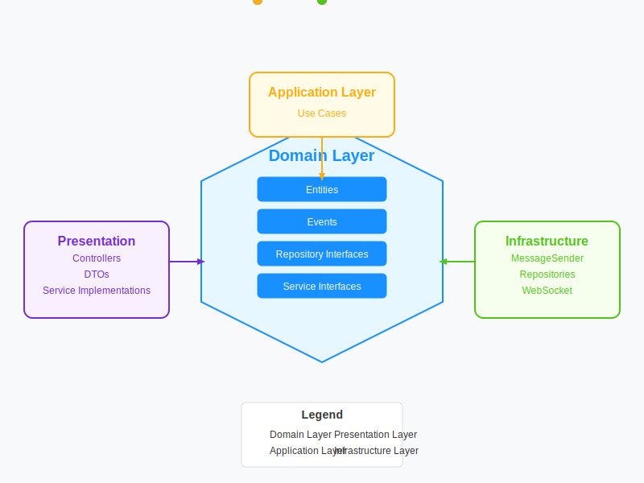
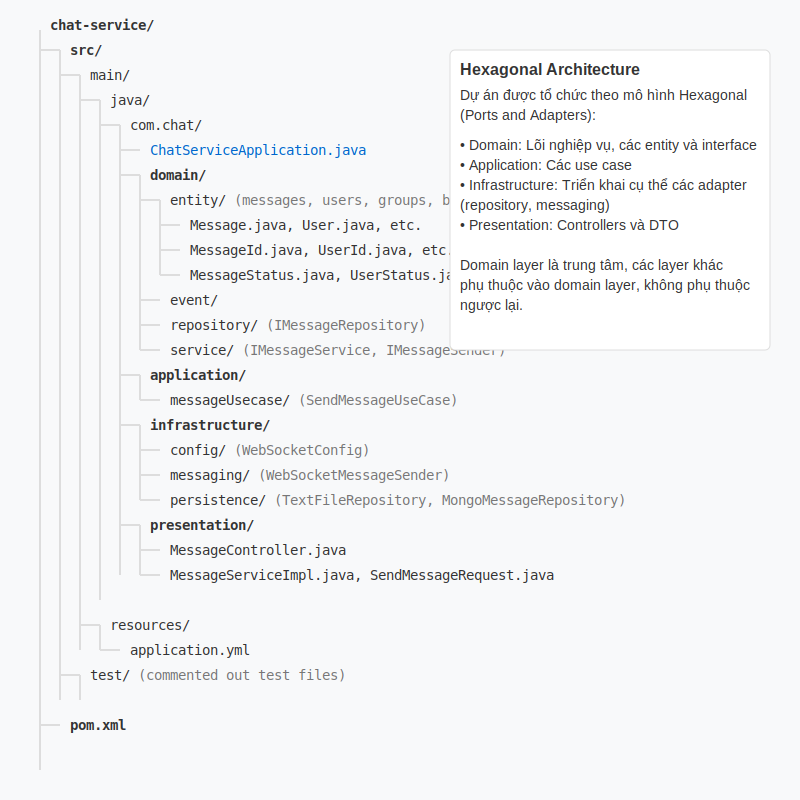
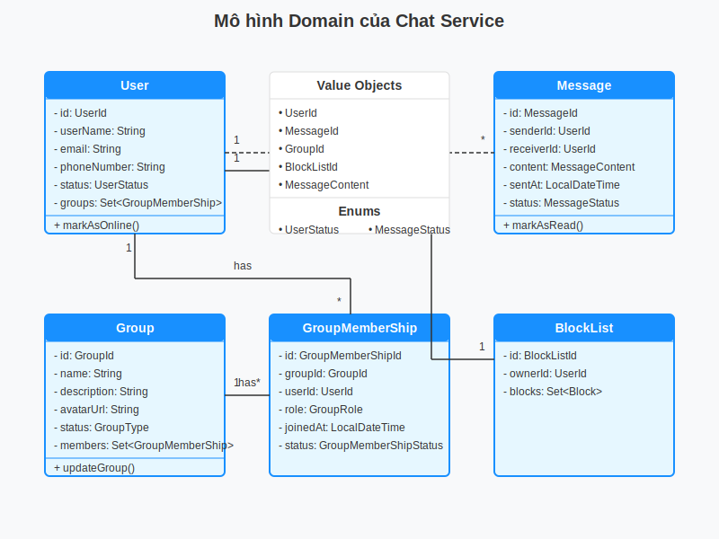
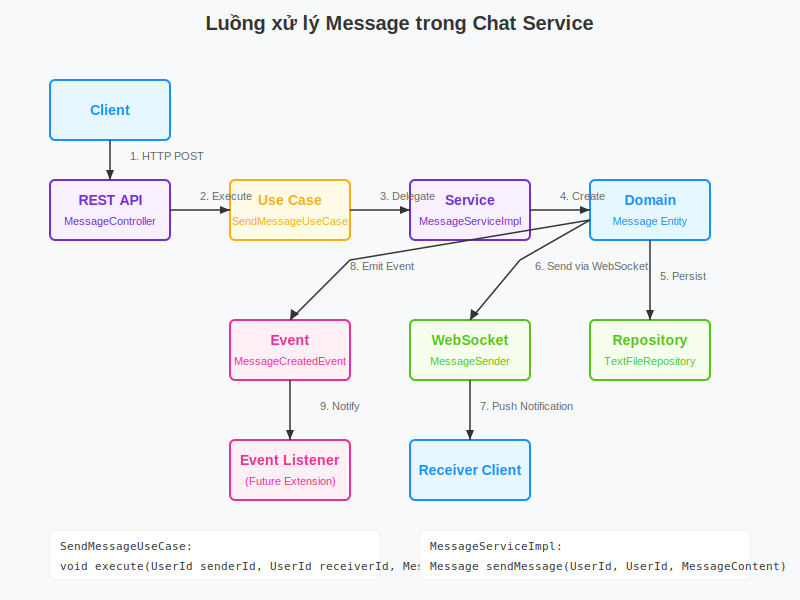

# ChatApp - Ứng dụng Nhắn tin Thời gian thực



## Giới thiệu

ChatApp là một ứng dụng nhắn tin thời gian thực được xây dựng với kiến trúc Domain-Driven Design (DDD), cho phép người dùng đăng ký, đăng nhập, và trao đổi tin nhắn theo thời gian thực. Ứng dụng được thiết kế với hiệu suất cao và khả năng mở rộng, sử dụng WebSocket cho giao tiếp thời gian thực, Kafka cho xử lý tin nhắn phân tán, và Redis cho caching.

## Cấu trúc dự án



Dự án được tổ chức theo kiến trúc Domain-Driven Design (DDD):



## mô hình Domain



ChatApp sử dụng kiến trúc event-driven kết hợp với microservices:

1. **Presentation Layer**: REST API và WebSocket endpoints
2. **Application Layer**: Orchestration và use cases
3. **Domain Layer**: Business logic và entities
4. **Infrastructure Layer**: Triển khai các interface cho database, messaging và caching

## Luồng làm việc



1. **Xác thực người dùng**:
   - Người dùng đăng ký/đăng nhập thông qua REST API
   - JWT được tạo và trả về cho client
   - Client sử dụng JWT cho các yêu cầu tiếp theo

2. **Kết nối WebSocket**:
   - Client thiết lập kết nối WebSocket với JWT
   - Server xác thực JWT và duy trì kết nối thông qua WebSocketSessionManager
   - Trạng thái online/offline của người dùng được theo dõi và cập nhật trong Redis

3. **Nhắn tin thời gian thực**:
   - Tin nhắn được gửi qua WebSocket
   - Tin nhắn được lưu trong MongoDB
   - Tin nhắn được publish lên Kafka để xử lý bất đồng bộ
   - Người nhận nhận tin nhắn thông qua WebSocket hoặc thông báo offline
   - Redis cache được sử dụng để cải thiện hiệu suất truy vấn

## Công nghệ sử dụng

- **Backend**:
  - Java Spring Boot
  - Spring Security + JWT Authentication
  - Spring WebSocket + STOMP
  - Apache Kafka cho xử lý tin nhắn phân tán
  - MongoDB cho lưu trữ dữ liệu
  - Redis cho caching và quản lý session
  - Lettuce client cho Redis connection pooling
  
- **Frontend**:
  - React.js với Material UI
  - SockJS và STOMP cho WebSocket
  - Axios cho HTTP requests

## Tính năng

- Đăng ký / Đăng nhập người dùng
- Xác thực và phân quyền bằng JWT
- Quản lý trạng thái online/offline của người dùng
- Tin nhắn thời gian thực với WebSocket
- Xử lý tin nhắn phân tán với Kafka
- Lưu trữ tin nhắn với MongoDB
- Cache dữ liệu người dùng với Redis
- Quản lý phiên WebSocket
- Mã hóa mật khẩu người dùng
- CORS configuration

## Cài đặt và chạy

### Yêu cầu

- Java 17+
- Maven
- MongoDB
- Redis
- Kafka

### Cài đặt

1. Clone repository:
   ```
   git clone https://github.com/yourusername/chatApp.git
   cd chatApp
   ```

2. Cài đặt MongoDB:
   ```
   # Tải và cài đặt từ https://www.mongodb.com/try/download/community
   # Hoặc sử dụng Docker:
   docker run -d -p 27017:27017 --name mongodb mongo
   ```

3. Cài đặt Redis:
   ```
   # Cho Windows
   Tải và cài đặt từ https://github.com/tporadowski/redis/releases
   
   # Cho Linux
   sudo apt-get install redis-server
   
   # Cho macOS
   brew install redis
   
   # Hoặc sử dụng Docker:
   docker run -d -p 6379:6379 --name redis redis
   ```

4. Cài đặt Kafka:
   ```
   # Tải từ https://kafka.apache.org/downloads
   # Hoặc sử dụng Docker Compose:
   docker-compose up -d
   ```

5. Cấu hình trong `application.yml`:
   - Đảm bảo thông tin kết nối MongoDB, Redis và Kafka đúng
   - Cập nhật JWT secret nếu cần

6. Cài đặt dependencies:
   ```
   mvn install
   ```

7. Chạy ứng dụng:
   ```
   mvn spring-boot:run
   ```

8. Truy cập ứng dụng:
   ```
   http://localhost:8080
   ```

## API Documentation

### Xác thực
- `POST /api/auth/register` - Đăng ký người dùng mới
- `POST /api/auth/login` - Đăng nhập và nhận JWT

### Người dùng
- `GET /api/users` - Lấy danh sách người dùng
- `GET /api/users/{id}` - Lấy thông tin người dùng theo ID
- `GET /api/users/status/{id}` - Kiểm tra trạng thái online của người dùng

### Tin nhắn
- `GET /api/messages/{conversationId}` - Lấy lịch sử tin nhắn của cuộc trò chuyện
- `GET /api/messages/unread/{userId}` - Lấy số tin nhắn chưa đọc

### WebSocket Endpoints
- Kết nối: `ws://localhost:8080/ws`
- Đăng ký nhận tin nhắn: `/topic/messages/{userId}`
- Gửi tin nhắn: `/app/chat.sendMessage`
- Đăng ký cập nhật trạng thái: `/topic/status`

## Cấu hình Kafka

Dự án sử dụng Kafka để xử lý tin nhắn phân tán:

- **Topic**: `message-topic` - Cho việc gửi và nhận tin nhắn
- **Consumer Group**: `my-group` - Nhóm consumer xử lý tin nhắn
- **Serialization**: Sử dụng custom serializer/deserializer cho tin nhắn

## Cấu hình Database

- **MongoDB**: Lưu trữ dữ liệu người dùng, tin nhắn và cuộc trò chuyện
  - Database: `chat_db`
  - Auto-index creation: `true`

- **Redis**: Lưu trữ cache người dùng và trạng thái session
  - Connection pooling với Lettuce
  - Max connections: 8

## Các lớp chính

- **UserService**: Quản lý người dùng, xác thực và xử lý trạng thái
- **MessageService**: Xử lý tin nhắn, lưu trữ và phân phối
- **RedisUserService**: Cache thông tin người dùng và trạng thái
- **WebSocketSessionManager**: Quản lý các kết nối WebSocket
- **JwtAuthenticationFilter**: Xác thực người dùng thông qua JWT
- **KafkaProducer/Consumer**: Xử lý tin nhắn bất đồng bộ

## Triển khai và Mở rộng

Ứng dụng được thiết kế để dễ dàng scale horizontally:
- Kafka cho phép nhiều instance xử lý tin nhắn
- Redis cluster cho caching phân tán
- MongoDB sharding cho lưu trữ dữ liệu lớn
- Stateless JWT authentication cho phép nhiều server hoạt động song song

## Debug và Logging

Ứng dụng cung cấp logging chi tiết cho nhiều thành phần:
- MongoDB operations
- WebSocket connections
- Security và authentication
- Controllers và services

## Đóng góp

1. Fork repository
2. Tạo feature branch (`git checkout -b feature/amazing-feature`)
3. Commit thay đổi (`git commit -m 'Add some amazing feature'`)
4. Push to branch (`git push origin feature/amazing-feature`)
5. Tạo Pull Request

## Giấy phép

MIT License

Copyright (c) 2024

Permission is hereby granted, free of charge, to any person obtaining a copy
of this software and associated documentation files (the "Software"), to deal
in the Software without restriction, including without limitation the rights
to use, copy, modify, merge, publish, distribute, sublicense, and/or sell
copies of the Software, and to permit persons to whom the Software is
furnished to do so, subject to the following conditions:

The above copyright notice and this permission notice shall be included in all
copies or substantial portions of the Software.