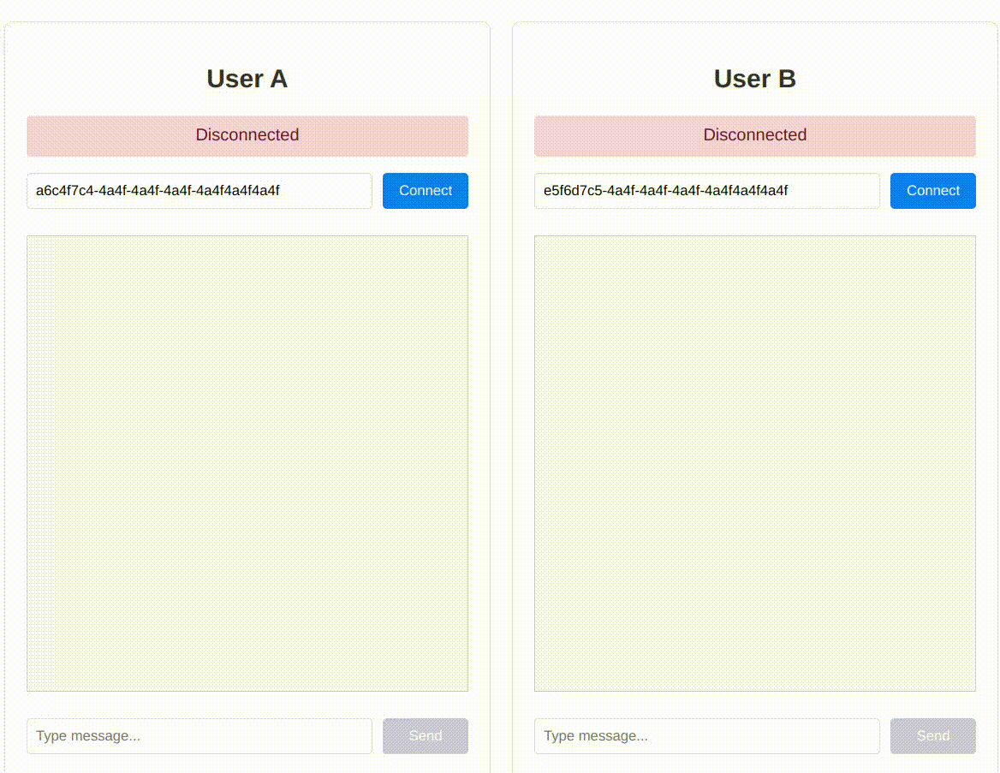
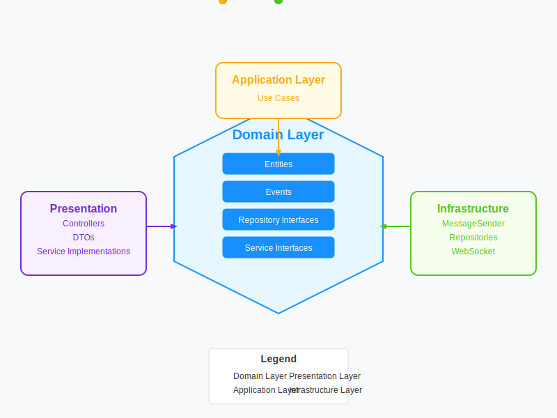
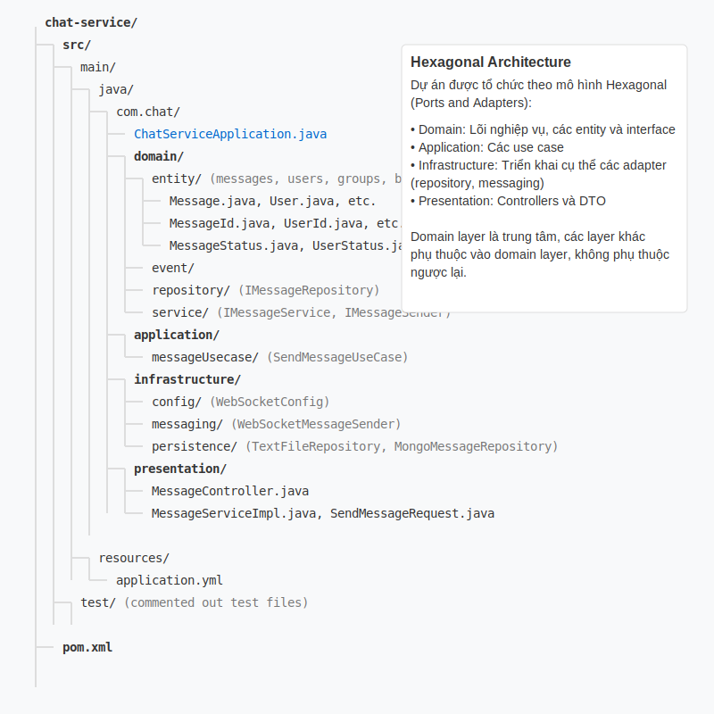

# ChatApp - Real-time Messaging Application



## Introduction

ChatApp is a real-time messaging application built using Domain-Driven Design (DDD) architecture, allowing users to register, log in, and exchange messages in real-time. The application is designed with high performance and scalability in mind, utilizing WebSocket for real-time communication, Kafka for distributed message processing, and Redis for caching.

## Project Structure



The project is organized according to Domain-Driven Design (DDD) architecture:



## Domain Model


ChatApp uses an event-driven architecture combined with microservices:

1. **Presentation Layer**: REST API and WebSocket endpoints
2. **Application Layer**: Orchestration and use cases
3. **Domain Layer**: Business logic and entities
4. **Infrastructure Layer**: Implementation of interfaces for database, messaging, and caching

## Workflow


1. **User Authentication**:
   - Users register/login through the REST API
   - JWT is generated and returned to the client
   - Client uses JWT for subsequent requests

2. **WebSocket Connection**:
   - Client establishes a WebSocket connection with JWT
   - Server authenticates JWT and maintains the connection through WebSocketSessionManager
   - User online/offline status is tracked and updated in Redis

3. **Real-time Messaging**:
   - Messages are sent via WebSocket
   - Messages are stored in MongoDB
   - Messages are published to Kafka for asynchronous processing
   - Recipients receive messages through WebSocket or offline notifications
   - Redis cache is used to improve query performance

## Technologies Used

- **Backend**:
  - Java Spring Boot
  - Spring Security + JWT Authentication
  - Spring WebSocket + STOMP
  - Apache Kafka for distributed message processing
  - MongoDB for data storage
  - Redis for caching and session management
  - Lettuce client for Redis connection pooling
  
- **Frontend**:
  - React.js with Material UI
  - SockJS and STOMP for WebSocket
  - Axios for HTTP requests

## Features

- User registration and login
- Authentication and authorization with JWT
- User online/offline status management
- Real-time messaging with WebSocket
- Distributed message processing with Kafka
- Message storage with MongoDB
- User data caching with Redis
- WebSocket session management
- Password encryption
- CORS configuration

## Installation and Setup

### Requirements

- Java 17+
- Maven
- MongoDB
- Redis
- Kafka

### Installation

1. Clone repository:
   ```
   git clone https://github.com/yourusername/chatApp.git
   cd chatApp
   ```

2. Install MongoDB:
   ```
   # Download and install from https://www.mongodb.com/try/download/community
   # Or use Docker:
   docker run -d -p 27017:27017 --name mongodb mongo
   ```

3. Install Redis:
   ```
   # For Windows
   Download and install from https://github.com/tporadowski/redis/releases
   
   # For Linux
   sudo apt-get install redis-server
   
   # For macOS
   brew install redis
   
   # Or use Docker:
   docker run -d -p 6379:6379 --name redis redis
   ```

4. Install Kafka:
   ```
   # Download from https://kafka.apache.org/downloads
   # Or use Docker Compose:
   docker-compose up -d
   ```

5. Configure `application.yml`:
   - Ensure MongoDB, Redis, and Kafka connection information is correct
   - Update JWT secret if needed

6. Install dependencies:
   ```
   mvn install
   ```

7. Run the application:
   ```
   mvn spring-boot:run
   ```

8. Access the application:
   ```
   http://localhost:8080
   ```

## API Documentation

### Authentication
- `POST /api/auth/register` - Register a new user
- `POST /api/auth/login` - Login and receive JWT

### Users
- `GET /api/users` - Get list of users
- `GET /api/users/{id}` - Get user information by ID
- `GET /api/users/status/{id}` - Check user's online status

### Messages
- `GET /api/messages/{conversationId}` - Get conversation message history
- `GET /api/messages/unread/{userId}` - Get number of unread messages

### WebSocket Endpoints
- Connection: `ws://localhost:8080/ws`
- Subscribe to messages: `/topic/messages/{userId}`
- Send message: `/app/chat.sendMessage`
- Subscribe to status updates: `/topic/status`

## Kafka Configuration

The project uses Kafka for distributed message processing:

- **Topic**: `message-topic` - For sending and receiving messages
- **Consumer Group**: `my-group` - Group of consumers processing messages
- **Serialization**: Uses custom serializer/deserializer for messages

## Database Configuration

- **MongoDB**: Stores user data, messages, and conversations
  - Database: `chat_db`
  - Auto-index creation: `true`

- **Redis**: Stores user cache and session status
  - Connection pooling with Lettuce
  - Max connections: 8

## Key Classes

- **UserService**: Manages users, authentication, and status handling
- **MessageService**: Processes messages, storage, and distribution
- **RedisUserService**: Caches user information and status
- **WebSocketSessionManager**: Manages WebSocket connections
- **JwtAuthenticationFilter**: Authenticates users via JWT
- **KafkaProducer/Consumer**: Handles asynchronous message processing

## Deployment and Scaling

The application is designed to scale horizontally:
- Kafka allows multiple instances to process messages
- Redis cluster for distributed caching
- MongoDB sharding for large data storage
- Stateless JWT authentication allows multiple servers to operate in parallel

## Debugging and Logging

The application provides detailed logging for various components:
- MongoDB operations
- WebSocket connections
- Security and authentication
- Controllers and services

## Contribution

1. Fork repository
2. Create feature branch (`git checkout -b feature/amazing-feature`)
3. Commit changes (`git commit -m 'Add some amazing feature'`)
4. Push to branch (`git push origin feature/amazing-feature`)
5. Create Pull Request

## License

MIT License

Copyright (c) 2024

Permission is hereby granted, free of charge, to any person obtaining a copy
of this software and associated documentation files (the "Software"), to deal
in the Software without restriction, including without limitation the rights
to use, copy, modify, merge, publish, distribute, sublicense, and/or sell
copies of the Software, and to permit persons to whom the Software is
furnished to do so, subject to the following conditions:

The above copyright notice and this permission notice shall be included in all
copies or substantial portions of the Software. 