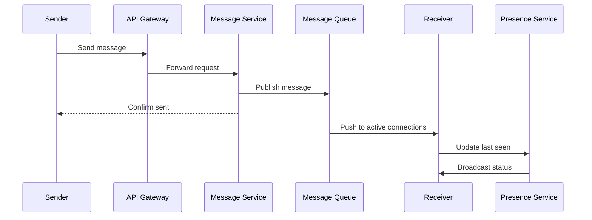

```mermaid
sequenceDiagram
    participant S as Sender
    participant AG as API Gateway
    participant MS as Message Service
    participant MQ as Message Queue
    participant R as Receiver
    participant PS as Presence Service

    S->>AG: Send message
    AG->>MS: Forward request
    MS->>MQ: Publish message
    MS-->>S: Confirm sent
    MQ->>R: Push to active connections
    R->>PS: Update last seen
    PS->>R: Broadcast status
```